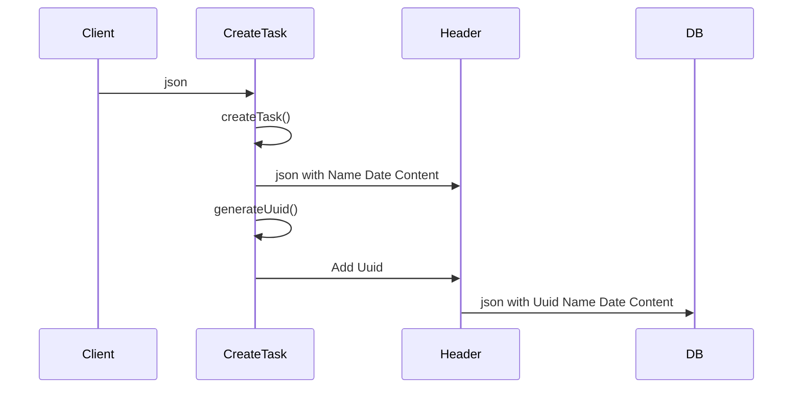
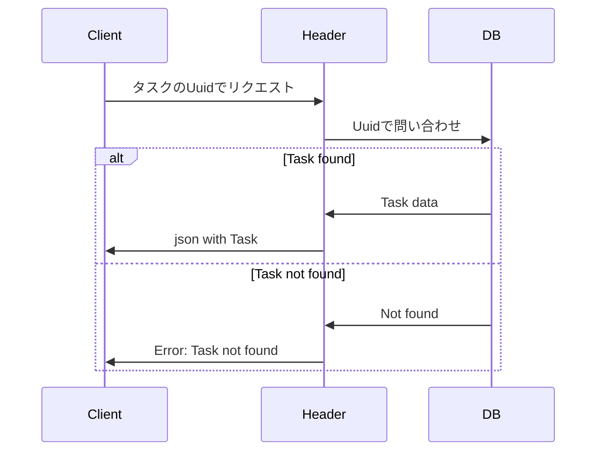
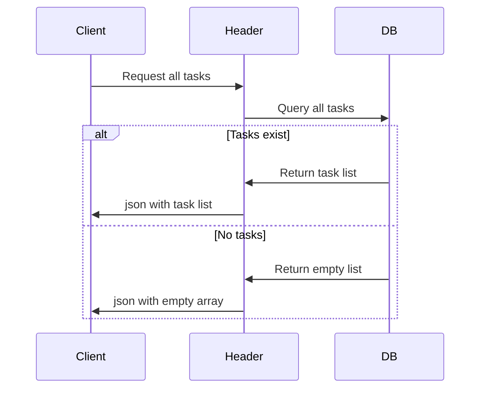
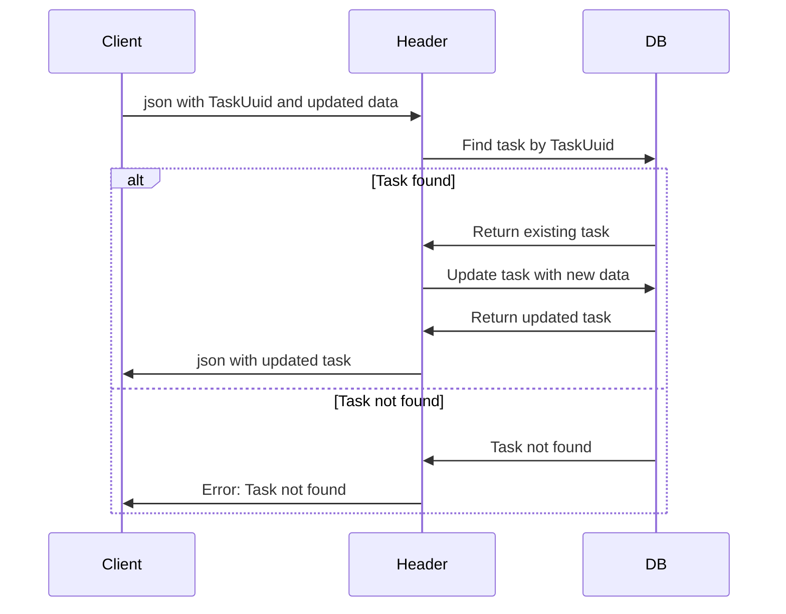
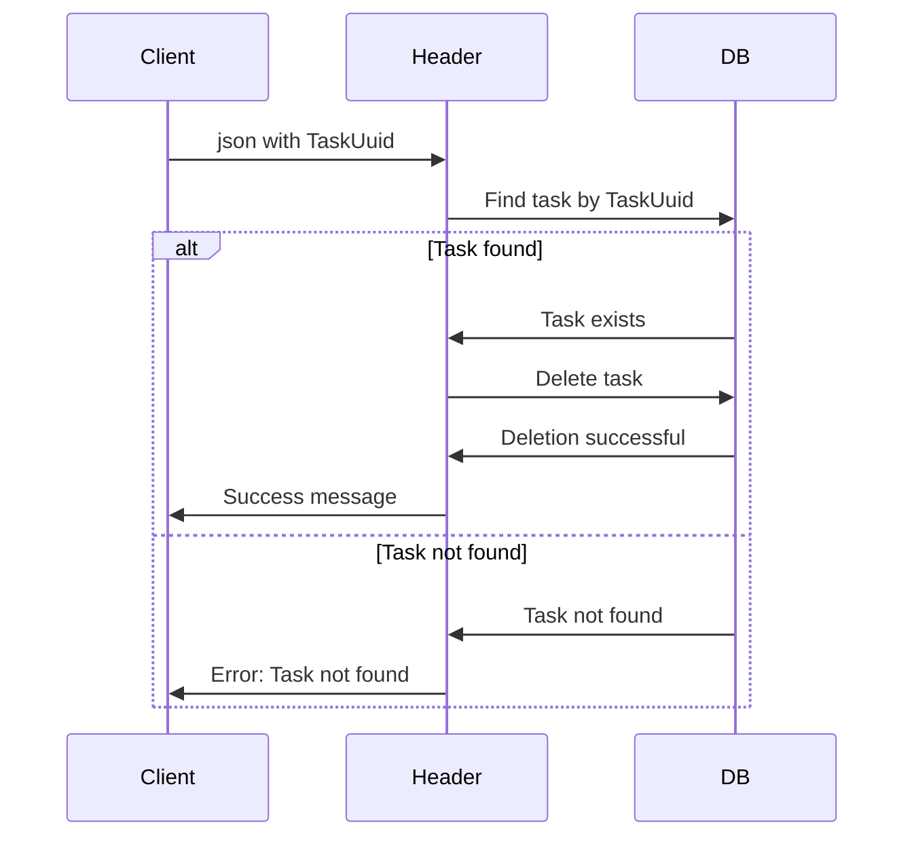
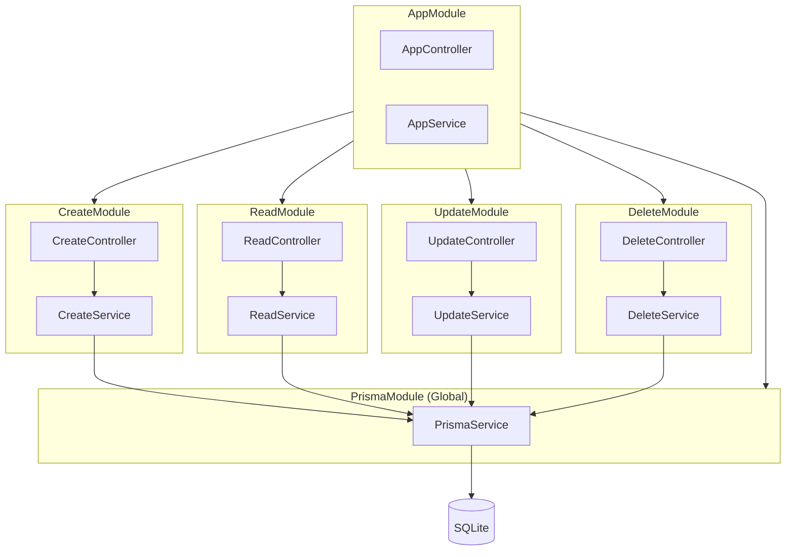

# NestJS TODO APP 仕様書

## 概要
NestJSを使用したTODOアプリケーションのCRUD機能実装

## 要件

CRUD機能を実装する

- **C (Create)**: タスクの作成
- **R (Read)**: 作成済みタスクの一覧読み込み
- **U (Update)**: 作成済みタスクの修正
- **D (Delete)**: 作成済みタスクの削除

---

## 機能詳細

### Create - TODOタスクの作成

#### タスク要件

| 項目 | 型 | 説明 |
|------|------|------|
| タスク名 | `string` | タスクの名称 |
| 開始日時 | `Date` | タスクの開始日時 |
| 終了日時 | `Date` | タスクの終了日時 |
| タスクの内容 | `string` | タスクの詳細内容 |

#### 仕様
- 作成したタスクはデータベースに保存する
- 作成時にタスクID（UUID）を自動生成してDBに登録する

#### シーケンス図



---

### Read - タスクの読み込み

#### 機能
- 指定したIDのタスクを取得
- データベースから一覧を読み込む（ReadOnly）
- 表示時は締切が近い順に並べる

#### 指定したタスクの取得



#### タスク一覧の取得



---

### Update - タスクの更新

#### 仕様
- 指定したタスクをデータベースから読み込み、変更したい項目を更新できるようにする
- フロー: Read → Update

#### シーケンス図



---

### Delete - タスクの削除

#### 仕様
- 指定したIDのタスクを削除する
- ~~削除時にはそのタスクの内訳を表示して確認を求めるようにする~~
- ~~Read → Delete~~
- ↑めんどくさくなりそうなので今回は割愛

#### シーケンス図



---

## アーキテクチャ

### モジュール構成図



### ファイル構成

```
src/
├── app.module.ts
├── app.controller.ts
├── app.service.ts
├── main.ts
├── prisma/
│   ├── prisma.module.ts
│   └── prisma.service.ts
├── modules/
│   ├── create/
│   │   ├── create.module.ts
│   │   ├── create.controller.ts
│   │   ├── create.service.ts
│   │   └── dto/
│   │       └── create-task.dto.ts
│   ├── read/
│   │   ├── read.module.ts
│   │   ├── read.controller.ts
│   │   └── read.service.ts
│   ├── update/
│   │   ├── update.module.ts
│   │   ├── update.controller.ts
│   │   ├── update.service.ts
│   │   └── dto/
│   │       └── update-task.dto.ts
│   └── delete/
│       ├── delete.module.ts
│       ├── delete.controller.ts
│       └── delete.service.ts
├── prisma/
│   ├── schema.prisma
│   └── migrations/
└── test/
```

### 各層の責務

| 層 | 責務 |
|---|---|
| **Controller** | HTTPリクエストの受付、レスポンスの返却 |
| **Service** | ビジネスロジックの実装 |
| **PrismaService** | データベースアクセス |
| **DTO** | データ転送オブジェクト、バリデーション |

## 技術スタック

- **Backend**: NestJS
- **Database**: SQLite (開発環境)
- **ORM**: Prisma
- **ID生成**: UUID

## 今後の課題

- 認証・認可機能の追加
- タスクのステータス管理（未着手/進行中/完了）
- タスクの優先度設定
- 削除時の確認機能実装
