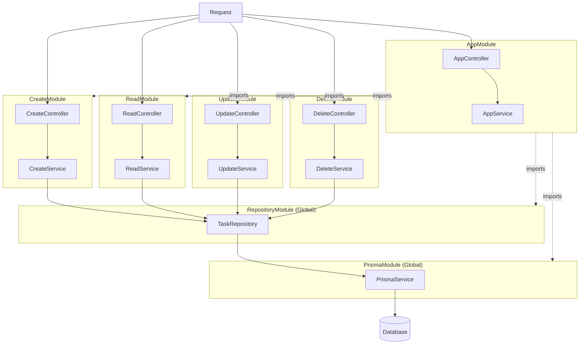

# NestJS TODO APP 仕様書

## 概要

NestJSを使用したTODOアプリケーションのCRUD機能実装

## 要件

CRUD機能を実装する

- **C (Create)**: タスクの作成
- **R (Read)**: 作成済みタスクの一覧読み込み
- **U (Update)**: 作成済みタスクの修正
- **D (Delete)**: 作成済みタスクの削除

---

## 機能詳細

### Create - TODOタスクの作成

#### タスク要件

| 項目         | 型       | 説明             |
| ------------ | -------- | ---------------- |
| タスク名     | `string` | タスクの名称     |
| 開始日時     | `Date`   | タスクの開始日時 |
| 終了日時     | `Date`   | タスクの終了日時 |
| タスクの内容 | `string` | タスクの詳細内容 |

#### 仕様

- 作成したタスクはデータベースに保存する
- 作成時にタスクID（UUID）を自動生成してDBに登録する

### ファイル構成

```
src/
├── app.module.ts
├── app.controller.ts
├── app.service.ts
├── main.ts
├── prisma/
│   ├── prisma.module.ts
│   └── prisma.service.ts
├── repositories/
│   ├── repository.module.ts
│   └── task.repository.ts
├── modules/
│   ├── create/
│   │   ├── create.module.ts
│   │   ├── create.controller.ts
│   │   ├── create.service.ts
│   │   └── dto/
│   │       └── create-task.dto.ts
│   ├── read/
│   │   ├── read.module.ts
│   │   ├── read.controller.ts
│   │   └── read.service.ts
│   ├── update/
│   │   ├── update.module.ts
│   │   ├── update.controller.ts
│   │   ├── update.service.ts
│   │   └── dto/
│   │       └── update-task.dto.ts
│   └── delete/
│       ├── delete.module.ts
│       ├── delete.controller.ts
│       └── delete.service.ts
├── prisma/
│   ├── schema.prisma
│   └── migrations/
└── test/
```

## アーキテクチャ

### モジュール構成図



#### Repository層の役割

- 基本的なCRUD操作を提供
- `findOne()`: 1件取得（全Moduleで共通利用）
- `findAll()`: 全件取得（基本実装）
- `create()`, `update()`, `delete()`: 各操作の実装

#### 各Moduleの役割

- **CreateModule**: タスク作成のビジネスロジック（UUID生成、バリデーション）
- **ReadModule**: タスクの全件取得のビジネスロジック（ソート、フィルタリング）
- **UpdateModule**: タスク更新のビジネスロジック（更新前チェック）
- **DeleteModule**: タスク削除のビジネスロジック（削除前チェック）

#### 共通化の方針

- データアクセスはRepository層で共通化
- ビジネスロジックは各Moduleで独自実装
- 依存関係: Module → Repository → Prisma → DB
- タスク読み込みの処理は他のModuleでも利用するのでReapotitory層に実装されているものを利用する
- タスクの全件取得の処理をReadModuleに実装する

### 各層の責務

| 層                | 責務                                   |
| ----------------- | -------------------------------------- |
| **Controller**    | HTTPリクエストの受付、レスポンスの返却 |
| **Service**       | ビジネスロジックの実装                 |
| **PrismaService** | データベースアクセス                   |

## 技術スタック

- **Backend**: NestJS
- **Database**: SQLite (開発環境)
- **ORM**: Prisma
- **ID生成**: UUID

---

## ローカル実行手順

### 1. 依存関係のインストール

```bash
pnpm install
```

### 2. Prismaクライアントの生成

```bash
npx prisma generate
```

このコマンドで、`prisma/schema.prisma`からTypeScript型定義とPrismaクライアントが生成されます。

### 3. データベースの作成とマイグレーション

```bash
npx prisma migrate dev --name init
```

このコマンドで：
- `prisma/dev.db`（SQLiteデータベースファイル）が自動作成されます
- `Task`テーブルが作成されます
- マイグレーションファイルが`prisma/migrations/`に保存されます

### 4. アプリケーションの起動

```bash
pnpm run start:dev
```

アプリケーションが`http://localhost:3000`で起動します。

### （オプション）Prisma Studioでデータベースを確認

```bash
npx prisma studio
```

ブラウザで`http://localhost:5555`が開き、データベースの内容をGUIで確認できます。

### トラブルシューティング

#### エラー: `Cannot find module '@prisma/client'`
→ `npx prisma generate`を実行してください

#### エラー: `Property 'task' does not exist on type 'PrismaService'`
→ `npx prisma generate`を実行してください

#### エラー: `Table 'Task' does not exist`
→ `npx prisma migrate dev --name init`を実行してください

#### データベースをリセットしたい場合
```bash
npx prisma migrate reset
```

---

## CRUD操作のコマンド

### Create - タスクの作成

```bash
curl -X POST http://localhost:3000/tasks \
  -H "Content-Type: application/json" \
  -d '{
    "name": "テストタスク",
    "startDate": "2024-01-01T00:00:00Z",
    "endDate": "2024-01-31T23:59:59Z",
    "content": "これはテストタスクです"
  }'
```

**レスポンス例:**
```json
{
  "id": "123e4567-e89b-12d3-a456-426614174000",
  "name": "テストタスク",
  "startDate": "2024-01-01T00:00:00.000Z",
  "endDate": "2024-01-31T23:59:59.000Z",
  "content": "これはテストタスクです",
  "createdAt": "2024-01-01T00:00:00.000Z",
  "updatedAt": "2024-01-01T00:00:00.000Z"
}
```

### Read - タスク一覧の取得

```bash
curl http://localhost:3000/tasks
```

**レスポンス例:**
```json
[
  {
    "id": "123e4567-e89b-12d3-a456-426614174000",
    "name": "テストタスク",
    "startDate": "2024-01-01T00:00:00.000Z",
    "endDate": "2024-01-31T23:59:59.000Z",
    "content": "これはテストタスクです",
    "createdAt": "2024-01-01T00:00:00.000Z",
    "updatedAt": "2024-01-01T00:00:00.000Z"
  }
]
```

**特定のフィールドだけを抽出（jqを使用）:**
```bash
# idとnameだけを抽出
curl http://localhost:3000/tasks | jq '[.[] | {id, name}]'

# idだけを抽出
curl http://localhost:3000/tasks | jq '.[].id'
```

### Update - タスクの更新

```bash
curl -X PUT http://localhost:3000/tasks/{タスクID} \
  -H "Content-Type: application/json" \
  -d '{
    "name": "更新されたタスク",
    "startDate": "2024-01-01T00:00:00Z",
    "endDate": "2024-01-31T23:59:59Z",
    "content": "更新された内容"
  }'
```

**実行例:**
```bash
curl -X PUT http://localhost:3000/tasks/123e4567-e89b-12d3-a456-426614174000 \
  -H "Content-Type: application/json" \
  -d '{
    "name": "更新されたタスク",
    "startDate": "2024-01-01T00:00:00Z",
    "endDate": "2024-01-31T23:59:59Z",
    "content": "更新された内容"
  }'
```

**レスポンス例:**
```json
{
  "id": "123e4567-e89b-12d3-a456-426614174000",
  "name": "更新されたタスク",
  "startDate": "2024-01-01T00:00:00.000Z",
  "endDate": "2024-01-31T23:59:59.000Z",
  "content": "更新された内容",
  "createdAt": "2024-01-01T00:00:00.000Z",
  "updatedAt": "2024-01-01T01:00:00.000Z"
}
```

### Delete - タスクの削除

```bash
curl -X DELETE http://localhost:3000/tasks/{タスクID}
```

**実行例:**
```bash
curl -X DELETE http://localhost:3000/tasks/123e4567-e89b-12d3-a456-426614174000
```

**レスポンス例:**
```json
{
  "id": "123e4567-e89b-12d3-a456-426614174000",
  "name": "テストタスク",
  "startDate": "2024-01-01T00:00:00.000Z",
  "endDate": "2024-01-31T23:59:59.000Z",
  "content": "これはテストタスクです",
  "createdAt": "2024-01-01T00:00:00.000Z",
  "updatedAt": "2024-01-01T00:00:00.000Z"
}
```

---

## APIエンドポイント一覧

| メソッド | エンドポイント      | 説明           |
| -------- | ------------------- | -------------- |
| POST     | `/tasks`            | タスクの作成   |
| GET      | `/tasks`            | タスク一覧取得 |
| PUT      | `/tasks/:id`        | タスクの更新   |
| DELETE   | `/tasks/:id`        | タスクの削除   |

---
